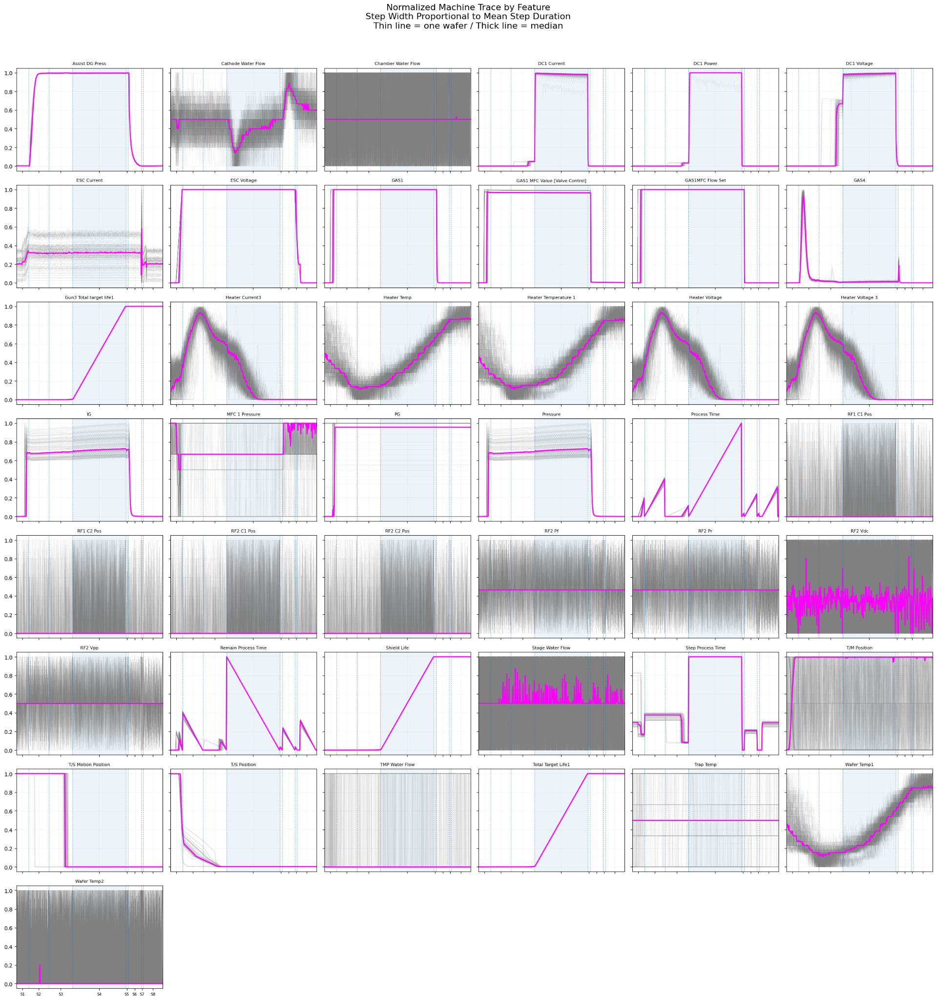
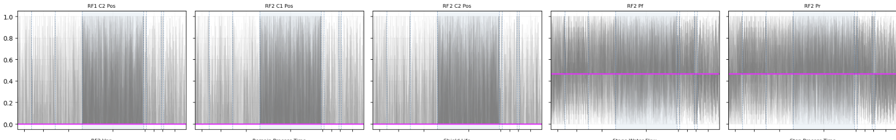
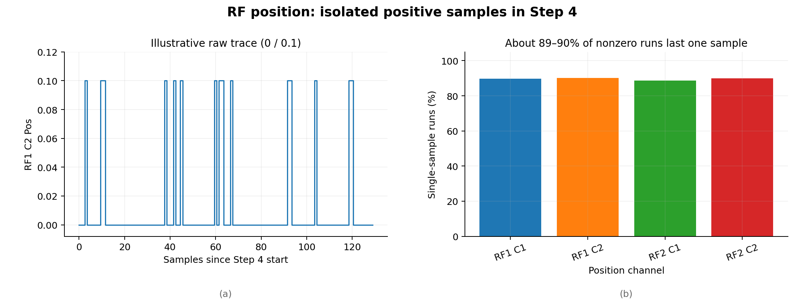
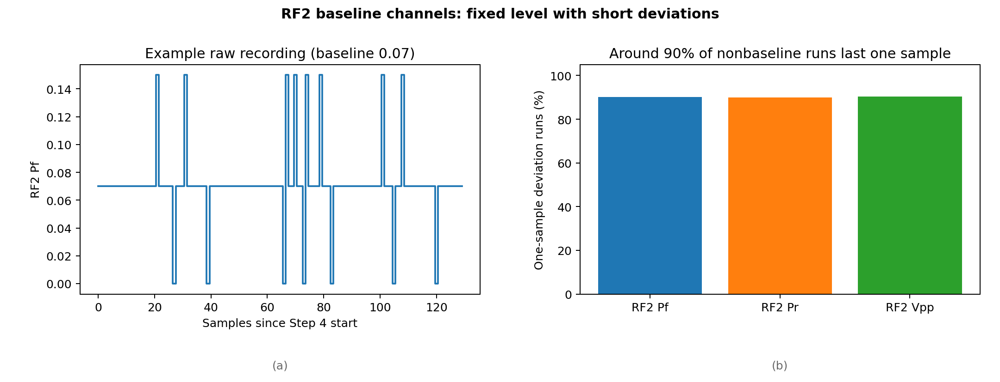
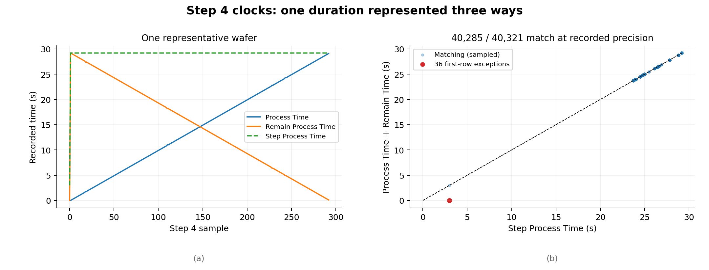
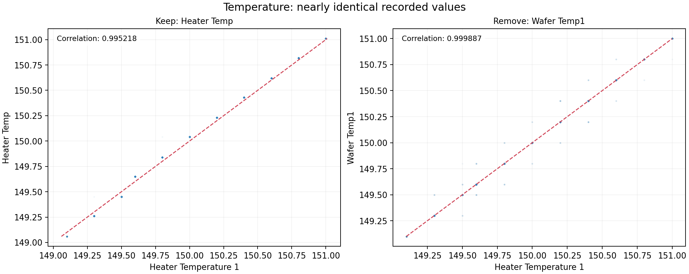
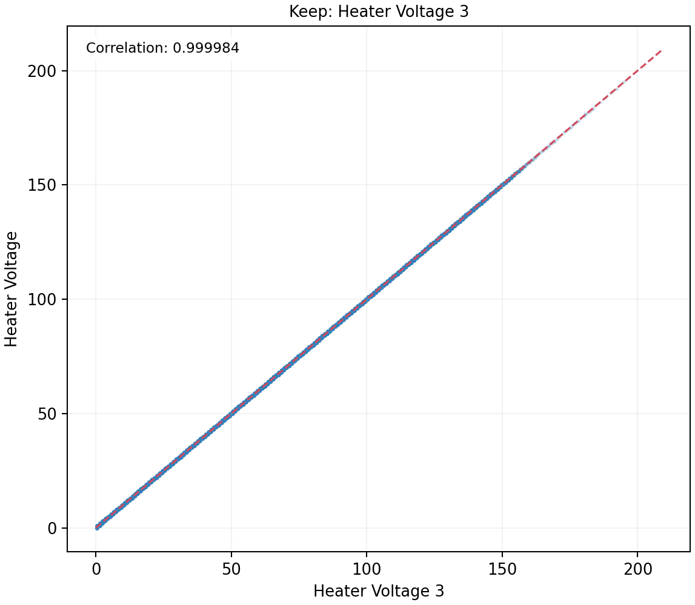
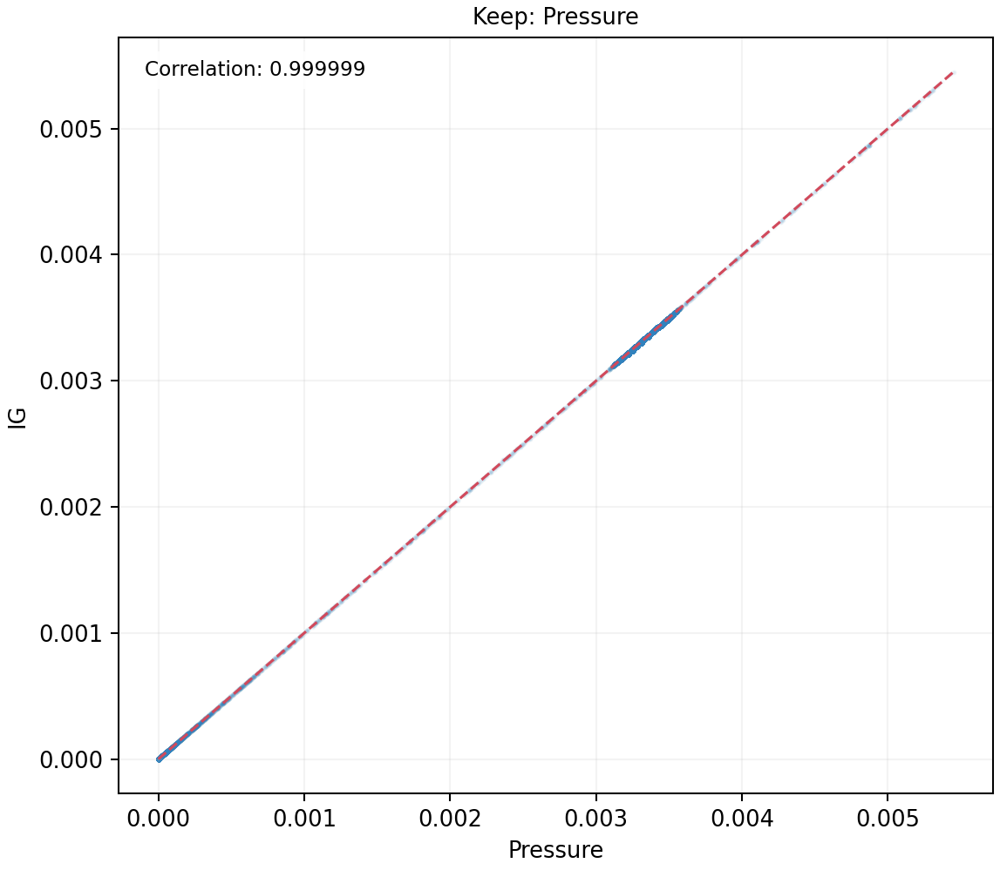

# ULVAC x_machine Trace EDA

Rev. 2 | Created: 2026-09-20 | Updated: 2026-09-20 18:47 CST

## 1. Purpose

- **Problem Statement**: ULVAC machine trace에는 약 128개의 <code>x_machine_</code> feature가 존재하며, 이를 그대로 사용하면 정보가 없는 feature와 중복되거나 일시적으로만 변하는 feature까지 모두 독립적인 sensor 정보로 취급할 수 있다.
- **Goal**: 전체 machine feature 중 실제 값의 변동이 확인된 43개 feature를 대상으로 원본 trace EDA를 수행하고, 각 feature를 제거·축약·보존할지 판단할 수 있는 근거를 수치와 그림으로 정리한다.
- **Non-Goal**: 값이 변하지 않는 단일값 feature에 대한 추가 분석과 두께 예측 model 학습 및 성능 비교는 다루지 않는다.

## 2. Summary

**RF 위치 및 RF2의 단발 신호는 sensor feature에서 빼고, 시간·온도·전압·압력의 중복 기록은 대표값 하나로 줄인다.** 아래 판단은 모델 성능 측정 결과가 아니라 **원본 trace에 실제로 기록된 값**을 비교한 결과다.

Table 1. Recommended treatment of machine channels

| Action | Reason | Figure |
| --- | --- | --- |
| RF 위치 4개 제외 | 원본의 약 96%가 0이고, 0을 벗어나는 구간 약 90%는 한 번의 기록으로 끝남 | Fig 2–3 |
| <code>RF2 Pf</code>·<code>RF2 Pr</code>·<code>RF2 Vpp</code> 제외 | 각자 평소 값이 원본의 약 90%이고, 변화가 나타나도 대개 한 번으로 끝남 | Fig 4 |
| 시간 3개를 Step 길이 하나로 축약 | Step 4 기록의 약 99.9%에서 지난 시간과 남은 시간의 합이 전체 시간과 같음 | Fig 5 |
| 온도 3개를 <code>Heater Temp</code> 하나로 축약 | 두 채널은 99.92%에서 정확히 같고, 남길 채널은 더 세밀한 값을 기록 | Fig 6 |
| 히터 전압 2개를 <code>Heater Voltage 3</code> 하나로 축약 | 두 채널의 상관계수 0.999984; 남길 채널은 소수 단위까지 기록 | Fig 7 |
| <code>IG</code>·<code>Pressure</code> 중 <code>Pressure</code> 보존 | 두 채널의 상관계수 0.999999 | Fig 8 |

여기서 ‘제외’는 **일반 sensor 통계값을 만드는 대상에서 제외**한다는 뜻이다. 원본 로그는 이상 기록을 확인할 수 있도록 남겨 둔다.

## 3. Scope

**Trace가 있는 wafer 156개의 <code>x_machine_</code> 기록으로 판단했다.** Step 번호는 구간을 나누는 데만 사용했다. 43개 feature는 앞서 **기준으로 삼은 특정 wafer**의 <code>x_machine_</code> 센서 128개 가운데 결측이 있거나 값이 변하지 않는 신호를 제외해 고른 것이다. 156개 wafer 모두에서 정확히 43개씩 유효하다는 뜻은 아니다. 본문에서는 선택한 feature가 다른 wafer에서는 어떻게 기록되는지도 원본값으로 확인했다.

Fig 1은 직접 만든 **정규화 trace 비교 그림**이다. 읽는 방법은 다음과 같다.

- **X축**: wafer마다 Step별 기록 길이가 달라서, 각 Step을 보간하고 다시 일정한 수로 맞춘 공정 진행 위치. 화면에서 Step의 폭은 그 Step의 평균 기록 수에 비례한다.
- **Y축**: 각 wafer 안에서 해당 센서의 최솟값을 0, 최댓값을 1로 바꾼 값.
- **하늘색 영역**: Step 4 구간.
- **옅은 회색 선**: wafer별 개별 센서 trace.
- **진한 분홍색 선**: 여러 wafer trace의 중앙값.

이 그림은 **신호의 모양을 비교**하는 데 쓴다. 원본값이 아주 작게 한 번 튀어도 0~1로 바꾸면 크게 보일 수 있어, 센서 제외 여부는 정규화 전 기록으로 결정했다.

Fig 1. Normalized machine traces aligned to mean step lengths.

## 4. Method

**값의 변동이 공정 내내 이어지는지, 한 번만 나타나는지, 다른 채널의 값과 사실상 같은지를 확인했다.** RF 채널은 원본에서 가장 자주 나오는 값과 Step별 가운데 값, Step 4에서 평소 값과 달라진 상태가 이어지는 기록 수를 비교했다. 시간 채널은 같은 순간에 기록된 세 값의 합을 확인했다. 온도·전압·압력은 같은 순간의 두 값을 나란히 비교하고 상관계수를 계산했다.

원본 기록으로 수치를 계산했고, 앞서 그린 Fig 1과 Fig 2는 정렬·정규화된 모양을 설명하는 데만 사용했다. 나머지 그래프는 원본 센서값 또는 원본 기록에서 계산한 관계를 보여 준다.

## 5. Result

### 5.1 RF position and baseline channels

**<code>RF1 C1 Pos</code>, <code>RF1 C2 Pos</code>, <code>RF2 C1 Pos</code>, <code>RF2 C2 Pos</code>는 일반 sensor feature에서 제외한다.** 네 채널 각각에서 원본값의 약 96.3~96.4%가 0이다. 156개 wafer의 8개 Step에서 가운데 값을 하나씩 구해도 모든 wafer·Step에서 네 채널 모두 0이다.

**0이 아닌 기록도 대부분 아주 짧다.** Step 4에서 0보다 큰 값이 연속으로 나타난 구간을 조사하면, 채널에 따라 약 88.7~90.2%가 **기록 한 번**으로 끝났다. 따라서 정규화 그림에서 회색 선이 복잡하게 보여도, wafer를 합쳐 본 분홍색 대표선에는 지속적인 위치 변화가 나타나지 않는다. Fig 2는 정규화 그림의 확대이고, Fig 3은 실제 원본값에서 짧은 튐이 얼마나 자주 나오는지 보여 준다.

Fig 2. Enlarged normalized RF traces for individual wafers and the median.

Fig 3. Raw RF position values and the proportion of one-sample pulses.

**<code>RF2 Pf</code>, <code>RF2 Pr</code>, <code>RF2 Vpp</code>도 같은 이유로 일반 sensor feature에서 제외한다.** 세 채널의 평소 기록값은 각각 0.07, 0.07, 0.12이며, 각 채널에서 이 값이 원본의 약 90%를 차지한다. 모든 wafer·Step의 가운데 값도 해당 평소 값이다. Step 4에서 그 값과 달라지는 구간의 약 90%가 한 번의 기록으로 끝난다. Fig 4는 실제 값과 짧은 변화의 비율을 보여 준다.

Fig 4. Raw RF2 readings and the proportion of one-sample changes.

**제거 범위는 위 일곱 채널로 한정한다.** 예를 들어 <code>RF2 Vdc</code>는 0이 전체 원본값의 약 55.7%이며, wafer·Step 가운데 값도 일부 구간에서 0이 아니다. 정규화 그림에서 비슷해 보인다는 이유만으로 같이 빼면 실제로 달라지는 구간을 놓칠 수 있다. 제외하는 일곱 채널의 원본값은 설비 기록을 점검할 때 확인할 수 있도록 보존한다.

### 5.2 Process time compression

**<code>Process Time</code>, <code>Remain Process Time</code>, <code>Step Process Time</code>은 각각 별도 sensor로 다루지 않고 Step의 공정 길이 하나로 축약한다.** Step 4에서는 원본 기록의 약 99.9%에서 다음 관계가 성립한다.

> Process Time + Remain Process Time = Step Process Time

**관계가 어긋난 기록 36건은 전부 Step 4의 첫 기록이다.** 세 값은 각각 0, 0, 3.0으로 찍혔다. 특정 시점의 시작 기록이 달랐다는 뜻이지, 세 시간 채널이 계속해서 서로 다른 공정 정보를 제공한다는 근거는 아니다. Fig 5에서 세 시간의 흐름과 시작 기록의 예외를 함께 확인할 수 있다.

Fig 5. Agreement between the three Step 4 time readings and first-record exceptions.

**Step 4를 축약할 때는 각 wafer의 첫 기록을 제외하고 <code>Step Process Time</code>의 가운데 값 하나를 저장한다.** 다른 Step에도 적용할 때는 먼저 같은 시간 관계가 성립하는지 확인한다. 나머지 두 시간 채널에서는 별도의 sensor 통계값을 만들지 않는다. 실제로 관측된 Step 길이가 필요하면 해당 Step의 기록 수와 기록 간격으로 따로 계산하고, 기록된 <code>Step Process Time</code>과 이름을 구분한다. 시작 기록의 예외값이 Step 길이를 대표하지 않도록 하기 위해서다.

### 5.3 Duplicated sensor

**온도 3채널은 <code>Heater Temp</code> 하나로 줄이고 <code>Heater Temperature 1</code>, <code>Wafer Temp1</code>은 일반 feature에서 제외한다.** <code>Heater Temperature 1</code>과 <code>Wafer Temp1</code>은 원본 기록의 **99.92%에서 정확히 같은 값**이다. <code>Heater Temp</code>는 좀 더 세밀한 소수 단위로 기록되며, <code>Heater Temperature 1</code>과의 값 차이는 두 건을 제외하면 0.05 이하이다. 이 두 예외 기록은 원본에서 확인할 수 있다.

Fig 6은 온도값을 둘씩 짝지어 그린 것이다. 점이 대각선에 가까울수록 두 채널에 거의 같은 값이 기록됐다는 뜻이다. **상관계수가 매우 높다는 사실만으로 채널을 지운 것이 아니라**, 정확히 같은 기록의 비율과 값 차이도 확인했다. 센서의 물리적인 연결 관계까지 이 그림에서 단정하지 않는다.

Fig 6. Correlation between temperature readings; dashed lines show equal values.

**히터 전압은 <code>Heater Voltage 3</code>만 남기고 <code>Heater Voltage</code>는 제외한다.** 두 값의 상관계수는 **0.999984**다. <code>Heater Voltage</code>는 정수로 기록되고, <code>Heater Voltage 3</code>은 소수까지 기록된다. 원본에서 두 값의 차이는 항상 0.5 이하이므로 더 세밀한 채널을 남기는 것이 간단하다. Fig 7에는 두 값의 상관관계만 표시했다.

Fig 7. Correlation between integer and decimal heater-voltage readings.

**<code>IG</code>와 <code>Pressure</code> 중에는 <code>Pressure</code>만 남긴다.** 두 값의 상관계수는 **0.999999**이며, 원본 기록에서 두 값의 차이는 최대 0.00001이다. 전체 기록 가운데 상대적인 차이가 1%를 넘는 것도 한 건뿐이다. Fig 8은 두 값이 함께 움직이는 모습을 보여 준다. 센서의 실제 하드웨어 구성이 같은지는 이 결과로 판단하지 않는다.

Fig 8. Correlation between IG and Pressure readings.

