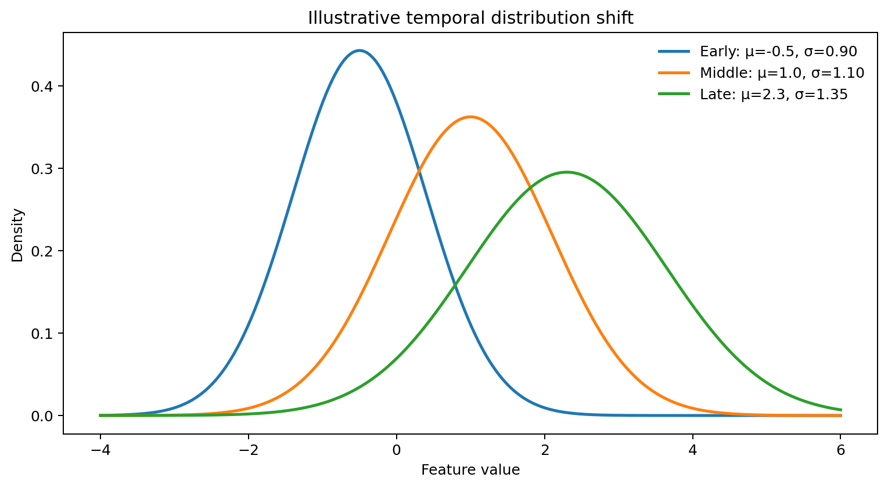
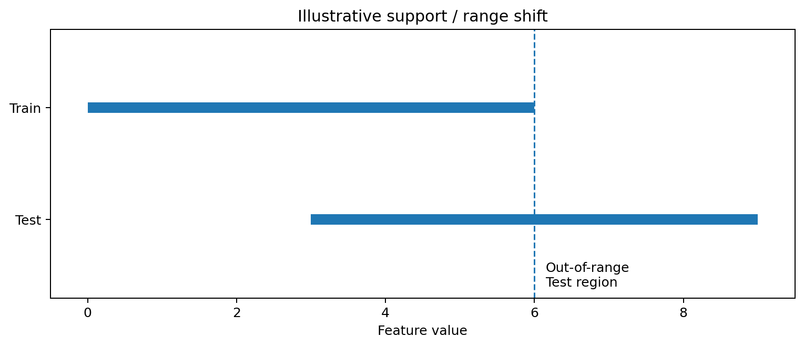

# Generalization under Feature Distribution Shift in Long Data
Rev. 1 | Created: 2026-09-16 | Updated: 2026-09-16 14:46 KST

## 1. Scope

### 1.1 Problem Statement

Train과 Test에서 평균과 분산을 포함한 feature distribution이 서로 다를 경우, Train에서 높은 성능을 보인 model이 Test에서는 성능이 저하될 수 있다. 본 문서는 이 generalization degradation을 feature distribution의 시간적 변화와 Train-Test support mismatch의 관점에서 다룬다 [[1](#ref-1)] [[5](#ref-5)].

본 문서에서는 이러한 현상을 **feature distribution shift**로 두고, 원인을 `Temporal Shift`와 `Support / Range Shift`의 두 축으로 분류한다. 두 축은 서로 배타적이지 않다. 예를 들어 feature가 시간에 따라 증가하면서 Test 범위가 Train 범위를 벗어나면 Temporal Shift와 Support / Range Shift가 동시에 발생한다.

### 1.2 Goal

Train과 Test 사이의 feature distribution 차이가 발생하는 원인을 분류하고, 각 문제에 대해 다음 내용을 정리한다.

- 발생 형태와 model generalization에 미치는 영향
- 분포 변화를 확인하기 위한 diagnosis 방법
- 실제 평가에 적합한 validation 방법
- 문제 특성에 따른 mitigation 방법

### 1.3 Non-Goal

다음 항목은 본 문서의 주요 범위에서 제외한다.

- Wide / high-dimensional data에서 발생하는 overfitting
- Target distribution 자체의 변화만을 다루는 label shift
- Feature와 target의 관계가 변하는 concept drift의 상세 방법론
- 특정 dataset에 대한 feature engineering 또는 model optimization
- 개별 model의 hyperparameter tuning

## 2. Taxonomy

Feature distribution shift는 **시간에 따라 분포가 변하는지**와 **Train이 Test 영역을 충분히 포함하는지**의 두 관점으로 구분한다.

Table 1. Feature distribution shift taxonomy

| Category | Question | Main symptom | Main risk |
|---|---|---|---|
| Temporal Shift | 시간이 지나면서 feature distribution이 변하는가 | 시간 구간별 mean, variance, quantile 변화 | 과거 data에서 학습한 관계의 현재 대표성 저하 |
| Support / Range Shift | Test가 Train에서 관측된 feature 영역 안에 있는가 | range 확장, 낮은 overlap, out-of-range sample | interpolation에서 extrapolation으로 전환 |

Temporal Shift는 **변화의 시간적 구조**를 설명하고, Support / Range Shift는 **Train과 Test가 차지하는 feature space의 기하적 관계**를 설명한다. 따라서 하나의 dataset에서 두 문제가 동시에 나타날 수 있다.

## 3. Temporal Shift

### 3.1 Definition

Temporal Shift는 시간의 흐름에 따라 feature distribution이 변하는 현상이다. 시간 $t_1$과 $t_2$에서의 feature distribution을 각각 $P_{t_1}(X)$, $P_{t_2}(X)$라고 할 때, $P_{t_1}(X) \neq P_{t_2}(X)$인 상태로 볼 수 있다.  
모든 time-indexed data가 Temporal Shift를 갖는 것은 아니며, 시간 순서가 존재하더라도 각 시간 구간의 distribution이 안정적으로 유지된다면 Temporal Shift라고 보기 어렵다.

Feature의 mean과 variance 변화는 Temporal Shift를 확인할 수 있는 대표적인 현상이다. 다만 mean과 variance가 같더라도 distribution의 비대칭, tail, multiple peak 또는 feature 간 dependency가 달라질 수 있으므로 두 통계량만으로 distribution이 동일하다고 판단할 수는 없다.

시간에 따른 변화는 일반적으로 다음 형태로 나타날 수 있다 [[4](#ref-4)].

- **Gradual change**: 여러 시점에 걸쳐 distribution이 점진적으로 이동하는 형태
- **Abrupt change**: 특정 시점 전후로 distribution이 빠르게 달라지는 형태
- **Recurring change**: 과거에 나타났던 distribution이 일정 조건이나 주기에 따라 다시 나타나는 형태

이 분류는 변화 속도를 설명하기 위한 것이며, mean / variance change와 별개의 현상은 아니다. 예를 들어 mean이 서서히 증가한다면 `mean change`이면서 동시에 `gradual change`이다.



Fig 1. Illustrative temporal distribution shift

Fig 1은 특정 dataset을 나타내는 결과가 아니라 Temporal Shift의 형태를 설명하기 위한 예시이다. 시간이 지남에 따라 distribution의 중심과 폭이 함께 이동하면 단일 Train distribution이 이후 Test distribution을 충분히 대표하지 못할 수 있다.

### 3.2 Generalization Risk

Model은 Train에서 관측된 feature distribution에 대해 empirical risk를 최소화한다. 이후 Test의 $P(X)$가 달라지면 Train에서 자주 관측된 영역과 실제 추론 시 중요한 영역의 비중이 달라질 수 있다. 이때 Train score가 높더라도 Test risk를 제대로 반영하지 못할 수 있다 [[2](#ref-2)] [[3](#ref-3)].

특히 오래된 sample과 최근 sample의 distribution이 지속적으로 멀어지는 경우에는 전체 historical data를 동일한 비중으로 학습하는 것이 항상 유리하지 않다. 오래된 data가 sample size는 증가시키지만 현재 Test distribution을 덜 대표할 수 있기 때문이다.

### 3.3 Diagnosis

Temporal Shift는 먼저 **시간 순서대로 distribution이 안정적인지** 확인하는 것이 핵심이다.

Table 2. Temporal Shift diagnosis

| Method | Purpose | Interpretation |
|---|---|---|
| Time-bucket statistics | 구간별 mean, standard deviation, quantile 비교 | 통계량의 지속적 이동 여부 확인 |
| Rolling statistics | rolling mean, standard deviation, quantile 추적 | gradual change와 local change 확인 |
| Distribution plot | 기간별 histogram, ECDF, KDE 비교 | 위치, 폭, tail, shape 변화 확인 |
| Two-sample test | 기간 간 distribution 차이 검정 | KS test 등으로 univariate 변화 확인 |
| Distribution distance | 변화 크기 정량화 | Wasserstein distance 등으로 상대적 변화 추적 |
| Change-point detection | 변화 시점 탐색 | abrupt regime 전환 후보 확인 |

Diagnosis에서 중요한 점은 **통계적 유의성과 model 영향도를 구분하는 것**이다. Sample 수가 많으면 작은 distribution 차이도 통계적으로 유의할 수 있으며, 반대로 유의한 shift가 반드시 prediction degradation으로 이어지는 것은 아니다. 따라서 distribution metric과 함께 시간 구간별 validation score를 비교해야 한다.

#### Example: Time-bucket Statistics

시간 순서에 따라 data를 몇 개의 bucket으로 나누고 feature별 mean과 standard deviation을 비교하면 Temporal Shift를 빠르게 확인할 수 있다. 아래 코드는 diagnosis의 시작점으로 사용할 수 있는 간단한 예시이다.

```python
import numpy as np
import pandas as pd

df = df.sort_values(time_col).copy()
df["time_bucket"] = pd.cut(
    np.arange(len(df)),
    bins=5,
    labels=False,
)

stats = df.groupby("time_bucket")[features].agg(["mean", "std"])
```

이 결과에서 bucket 순서에 따라 mean 또는 standard deviation이 한 방향으로 이동하는 feature가 있다면 rolling statistics와 distribution plot을 추가로 확인한다.

### 3.4 Mitigation

Temporal Shift에 대한 mitigation의 핵심은 **현재 Test distribution을 더 잘 대표하는 data에 학습과 평가의 비중을 높이는 것**이다.

#### Time-aware Validation

Random split은 과거와 미래 sample을 섞기 때문에 temporal shift가 존재할 때 실제 배포 상황보다 쉬운 validation을 만들 수 있다. 시간 순서를 유지하는 holdout, expanding-window validation 또는 rolling-window validation을 사용해 과거로 학습하고 미래를 평가하는 구조를 유지해야 한다. `TimeSeriesSplit`도 이러한 목적의 forward split을 제공한다 [[6](#ref-6)].

#### Recent-window Training

최근 일정 구간만 사용하여 model을 학습한다. 오래된 distribution의 영향을 줄일 수 있지만 window가 너무 짧으면 sample size 감소로 variance가 커질 수 있다. 따라서 window length는 고정값으로 가정하기보다 time-aware validation으로 선택해야 한다.

#### Time-decay Weighting

모든 historical sample을 제거하는 대신 최근 sample에 더 높은 weight를 부여한다. Distribution이 점진적으로 변하는 상황에서 오래된 data의 정보는 유지하면서 현재 distribution에 더 큰 비중을 둘 수 있다.

#### Retraining and Regime Update

Distribution 변화가 지속되거나 abrupt change가 확인되는 경우, 새로운 data를 포함하여 model을 갱신한다. 일정 주기의 periodic retraining과 shift detection을 trigger로 사용하는 event-driven retraining을 구분할 수 있다. Abrupt change 이후 이전 regime의 대표성이 크게 낮아졌다면 change point 이후의 data를 중심으로 다시 학습하는 방법도 고려할 수 있다 [[4](#ref-4)].

#### Importance Weighting

Train과 Test의 conditional relationship이 유지되고 input distribution만 달라진다는 covariate shift 가정이 타당하다면, Test에서 상대적으로 자주 나타나는 영역의 Train sample에 더 높은 weight를 부여할 수 있다 [[2](#ref-2)] [[3](#ref-3)].

$$
w(x)=\frac{p_{test}(x)}{p_{train}(x)} \hspace{19em} (1)
$$

Importance weighting은 Train support 안에 Test sample이 충분히 존재할 때 의미가 있다. Test가 Train에서 관측되지 않은 영역으로 이동한 경우에는 density ratio를 안정적으로 추정할 수 없으므로 Support / Range Shift를 먼저 확인해야 한다.

### 3.5 Limitations

Scaling만으로 Temporal Shift 자체가 해결되는 것은 아니다. 예를 들어 Train mean과 standard deviation으로 `StandardScaler`를 적용하면 scale은 변하지만 Train과 Test의 상대적 distribution 차이는 남는다. 반대로 Test 전체의 mean과 standard deviation을 이용하여 별도로 정규화하면 실제 추론 시점에 사용할 수 없는 미래 정보를 사용할 가능성이 있으므로 validation leakage를 검토해야 한다.

또한 expanding window가 항상 rolling window보다 우수한 것도 아니다. 과거 data가 현재에도 유효하다면 expanding window가 안정적인 반면, distribution이 지속적으로 이동하면 오래된 sample이 최근 pattern을 희석할 수 있다. 따라서 두 방법의 선택 자체도 time-aware validation 대상으로 두는 것이 적절하다.

## 4. Support / Range Shift

### 4.1 Definition

Support / Range Shift는 Test sample이 Train에서 충분히 관측된 feature 영역과 다른 영역에 위치하는 문제이다. 평균과 분산이 유사하더라도 일부 Test sample이 Train의 sparse region 또는 범위 밖에 위치하면 발생할 수 있다.

본 문서에서는 정도에 따라 다음 세 상태를 구분한다.

- **Range expansion**: Test의 관측 범위가 Train보다 넓은 상태
- **Low-overlap region**: Train과 Test distribution이 겹치지만 일부 영역의 coverage가 부족한 상태
- **Extrapolation**: Test sample이 Train에서 실질적으로 관측되지 않은 영역에 위치하는 상태

이 구분은 명확한 단일 경계가 있는 taxonomy라기보다 support mismatch의 심각도를 판단하기 위한 실무적 구분이다.



Fig 2. Illustrative Support / Range Shift

Fig 2와 같이 Test가 Train과 일부 영역에서는 겹치더라도 Train의 관측 범위를 넘어서는 구간이 존재할 수 있다. 겹치는 영역은 interpolation에 가깝지만, Train support 밖의 Test region은 extrapolation risk를 가진다.

### 4.2 Generalization Risk

Supervised model의 prediction은 기본적으로 Train에서 관측한 data를 근거로 한다. Test sample이 Train의 dense region에 위치하면 interpolation에 가깝지만, Train support의 경계로 갈수록 주변 학습 sample이 감소하고 prediction uncertainty가 커질 수 있다.

특히 Train support 밖의 extrapolation에서는 validation data가 해당 영역을 포함하지 않는 한 model reliability를 사전에 확인하기 어렵다. Model architecture에 따라서도 외삽 특성이 다르다. 예를 들어 decision tree는 piecewise constant approximation이므로 extrapolation에 적합하지 않다 [[7](#ref-7)]. Linear 또는 parametric model은 수학적으로 범위 밖 prediction을 생성할 수 있지만, 학습된 functional form이 외삽 영역에서도 유지된다는 근거가 없으면 정확성을 보장할 수 없다.

### 4.3 Diagnosis

Support / Range Shift는 단순 mean / variance 비교보다 **coverage와 overlap**을 직접 확인해야 한다.

Table 3. Support / Range Shift diagnosis

| Method | Purpose | Interpretation |
|---|---|---|
| Min-max comparison | feature별 관측 범위 비교 | Test range가 Train range를 초과하는지 확인 |
| Quantile comparison | extreme value 영향 완화 | central range와 tail shift 구분 |
| Out-of-range rate | Test의 Train range 이탈 비율 계산 | feature별 extrapolation 빈도 확인 |
| Distribution overlap | histogram, ECDF, KDE 비교 | Train과 Test가 공유하는 영역 확인 |
| Nearest-neighbor distance | Test와 가장 가까운 Train sample 거리 | sparse 또는 unseen region 탐색 |
| Train-vs-Test classifier | 두 dataset의 분리 가능성 확인 | 높은 구분 성능이면 multivariate mismatch 가능성 증가 |

Feature별 min-max만으로 multivariate support를 완전히 판단할 수는 없다. 각 feature가 개별 범위 안에 있더라도 Train에서 관측되지 않은 feature 조합이 Test에 나타날 수 있기 때문이다. 따라서 중요한 feature가 여러 개라면 univariate range check와 sample-level distance 또는 Train-vs-Test classifier를 함께 사용하는 것이 적절하다.

#### Example: Out-of-range Rate

Feature별로 Test sample이 Train min-max를 벗어나는 비율을 계산하면 어떤 feature에서 range mismatch가 큰지 빠르게 확인할 수 있다.

```python
train_min = X_train.min(axis=0)
train_max = X_train.max(axis=0)

out_of_range = (X_test.lt(train_min) | X_test.gt(train_max))
out_of_range_rate = out_of_range.mean().sort_values(ascending=False)
```

`out_of_range_rate`가 높은 feature는 range-separated validation이나 sample-level distance 분석의 우선 대상으로 볼 수 있다. 단, 이 값은 feature별 univariate check이므로 multivariate support를 완전히 표현하지는 않는다.

### 4.4 Mitigation

Support / Range Shift는 Temporal Shift보다 model 내부 기법만으로 해결하기 어렵다. 특히 Test가 Train support 밖에 있다면, 가장 직접적인 대응은 해당 영역의 training data를 확보하는 것이다.

#### Training Coverage Expansion

실제 inference에서 필요한 range를 포함하도록 data collection 범위를 확장한다. 새로운 영역의 label을 확보할 수 있다면 extrapolation 문제를 interpolation 문제로 전환할 수 있어 가장 직접적인 mitigation이 된다.

#### Inference Guardrail

Train support에서 지나치게 먼 sample을 탐지하고 prediction과 함께 reliability flag를 제공하거나, 별도의 fallback rule을 적용한다. 이는 extrapolation을 해결하는 방법이 아니라 **위험한 prediction을 식별하는 방법**이다.

#### Overlap-aware Weighting

Train과 Test가 충분히 겹치지만 density만 다른 경우에는 importance weighting을 적용할 수 있다. 반면 Test-only region에는 대응되는 Train sample이 없으므로 reweighting만으로 해결할 수 없다 [[2](#ref-2)] [[3](#ref-3)].

#### Model Selection under Extrapolation

외삽이 필요한 문제에서는 model의 extrapolation behavior를 validation에 포함해야 한다. Linear 또는 구조가 명시된 parametric model은 가정한 functional form을 범위 밖으로 연장할 수 있지만, 이 특성이 실제 관계와 일치하는지는 별도로 검증해야 한다. 따라서 단순히 Train score가 높은 model보다 **range-separated validation에서 안정적인 model**을 선택하는 것이 중요하다.

### 4.5 Limitations

Out-of-range 여부를 feature별 min-max만으로 정의하면 multivariate combination shift를 놓칠 수 있다. 반대로 nearest-neighbor distance도 scaling과 dimensionality에 민감하다. 따라서 support 진단은 하나의 threshold로 단정하기보다 여러 지표를 함께 사용하고, 실제 prediction error가 distance 또는 range 이탈과 함께 증가하는지 확인해야 한다.

## 5. Validation Strategy

Feature distribution shift가 의심되는 경우 validation은 단순한 평균 성능 측정보다 **어떤 shift에서 성능이 떨어지는지 재현하는 역할**을 해야 한다.

### 5.1 Temporal Validation

시간이 중요한 data에서는 Train이 항상 Test보다 과거에 위치하도록 split한다. Random split과 temporal split의 score 차이가 크다면 random split이 실제 미래 generalization을 과대평가했을 가능성을 확인해야 한다 [[6](#ref-6)].

### 5.2 Range-based Validation

Feature range 또는 distance를 기준으로 validation sample을 나누어 near-support와 far-support 성능을 비교한다. 이 방식은 Test 전체 score 하나만으로는 보이지 않는 extrapolation sensitivity를 확인하는 데 유용하다.

### 5.3 Stability Evaluation

단일 split에서 가장 높은 score를 찾기보다 여러 시간 구간과 range 구간에서 성능이 안정적으로 유지되는지 확인한다. Shift 환경에서는 평균 score뿐 아니라 fold 간 variance, worst-period error, out-of-range error를 함께 보는 것이 model selection에 더 적합할 수 있다.

Table 4. Validation design by shift type

| Shift type | Recommended validation | Main check |
|---|---|---|
| Gradual Temporal Shift | Rolling or expanding validation | 시간 경과에 따른 score degradation |
| Abrupt Temporal Shift | Pre-change / post-change split | regime 전환 이후 성능 유지 여부 |
| Low-overlap Shift | Density or distance-stratified validation | sparse region 성능 |
| Extrapolation | Range-separated holdout | Train range 밖 prediction 성능 |

## 6. Recommended Workflow

Feature distribution shift가 관찰되었을 때는 model을 바로 변경하기보다 shift의 형태를 먼저 확인하는 것이 적절하다.

```text
# Pseudocode
Train / Test feature distribution comparison
  -> Check temporal statistics and distribution change
  -> Check support overlap and out-of-range samples
  -> Identify dominant shift pattern
  -> Design validation that reproduces the shift
  -> Apply mitigation matched to the diagnosed pattern
  -> Re-evaluate overall and shifted-region performance
```

첫 단계에서는 mean과 standard deviation 차이를 확인하되, 여기에서 분석을 끝내지 않는다. 시간에 따른 변화라면 Temporal Shift의 형태를 확인하고, Test가 Train의 관측 영역을 벗어나는지 Support / Range Shift를 추가로 확인한다. 이후 선택한 mitigation은 동일한 shift를 재현하는 validation에서 효과를 검증한다.

Table 5. Diagnosis-to-mitigation mapping

| Problem | Diagnosis | Mitigation |
|---|---|---|
| Gradual Temporal Shift | rolling statistics, time-bucket distribution | recent window, time-decay weighting, periodic retraining |
| Abrupt Temporal Shift | change-point candidate, pre/post distribution | post-change retraining, regime update |
| Range Expansion | min-max, quantile, out-of-range rate | training coverage expansion, range-aware validation |
| Low-overlap Region | overlap, nearest distance, Train-vs-Test classifier | importance weighting, additional sampling |
| Extrapolation | out-of-range rate, distance, range-separated error | training coverage expansion, inference guardrail, extrapolation-aware model selection |

## 7. Key Points

- Train과 Test의 mean / variance 차이는 feature distribution shift의 **관찰 지표**이며 원인 자체로 단정하지 않는다.
- Temporal Shift는 distribution이 **시간에 따라 어떻게 변하는지**를 다룬다.
- Support / Range Shift는 Test가 Train의 **관측 영역 안에 존재하는지**를 다룬다.
- 두 shift는 동시에 발생할 수 있으므로 별도로 diagnosis한 뒤 함께 해석한다.
- Temporal Shift에서는 recent data 반영, weighting, retraining이 주요 mitigation이다.
- Extrapolation에서는 model 변경보다 training coverage 확보가 가장 직접적인 mitigation이다.
- Mitigation 효과는 random split이 아니라 실제 shift를 재현하는 validation에서 확인해야 한다.

## References

<a id="ref-1"></a>
[1] J. Quiñonero-Candela, M. Sugiyama, A. Schwaighofer, and N. D. Lawrence, eds., [*Dataset Shift in Machine Learning*](https://doi.org/10.7551/mitpress/9780262170055.001.0001), The MIT Press, 2008. ISBN 9780262170055.

<a id="ref-2"></a>
[2] H. Shimodaira, [“Improving Predictive Inference under Covariate Shift by Weighting the Log-likelihood Function”](https://doi.org/10.1016/S0378-3758(00)00115-4), *Journal of Statistical Planning and Inference*, vol. 90, no. 2, pp. 227-244, 2000.

<a id="ref-3"></a>
[3] M. Sugiyama, M. Krauledat, and K.-R. Müller, [“Covariate Shift Adaptation by Importance Weighted Cross Validation”](https://jmlr.org/papers/v8/sugiyama07a.html), *Journal of Machine Learning Research*, vol. 8, pp. 985-1005, 2007.

<a id="ref-4"></a>
[4] J. Gama, I. Žliobaitė, A. Bifet, M. Pechenizkiy, and A. Bouchachia, [“A Survey on Concept Drift Adaptation”](https://doi.org/10.1145/2523813), *ACM Computing Surveys*, vol. 46, no. 4, article 44, 2014.

<a id="ref-5"></a>
[5] J. G. Moreno-Torres, T. Raeder, R. Alaiz-Rodríguez, N. V. Chawla, and F. Herrera, [“A Unifying View on Dataset Shift in Classification”](https://doi.org/10.1016/j.patcog.2011.06.019), *Pattern Recognition*, vol. 45, no. 1, pp. 521-530, 2012.

<a id="ref-6"></a>
[6] scikit-learn, [“TimeSeriesSplit”](https://sklearn.org/stable/modules/generated/sklearn.model_selection.TimeSeriesSplit.html), scikit-learn documentation, accessed 2026-09-16.

<a id="ref-7"></a>
[7] scikit-learn, [“Decision Trees”](https://scikit-learn.org/stable/modules/tree.html), scikit-learn documentation, accessed 2026-09-16.

---

## Appendix A. Terminology

- **Covariate shift**: Train과 Test의 $P(X)$는 다르지만 $P(Y\mid X)$가 유지된다고 가정하는 dataset shift의 한 형태.
- **Distribution shift**: Train과 Test에서 관측되는 probability distribution이 동일하지 않은 상태.
- **Extrapolation**: Train에서 충분히 관측되지 않은 feature 영역에 대해 prediction을 수행하는 상황.
- **Feature distribution shift**: Train과 Test의 input distribution $P(X)$가 서로 다른 현상을 가리키는 본 문서의 중립적 표현.
- **Generalization**: Train에 포함되지 않은 data에서 model이 prediction performance를 유지하는 능력.
- **ECDF**: Empirical Cumulative Distribution Function. 관측 sample로부터 계산한 누적분포함수.
- **Empirical risk**: Train sample에서 계산한 loss의 평균.
- **KDE**: Kernel Density Estimation. Sample로부터 probability density를 추정하는 non-parametric 방법.
- **KS test**: Kolmogorov-Smirnov test. 두 sample의 empirical distribution 차이를 비교하는 통계 검정.
- **Mitigation**: 문제를 반드시 제거한다는 의미가 아니라 영향과 위험을 줄이기 위한 대응 방법.
- **Support**: Probability distribution에서 positive probability 또는 density를 가지는 feature space의 영역. 실무적으로는 Train이 충분히 관측한 영역이라는 의미로 사용.
- **Temporal Shift**: 시간에 따라 feature distribution이 변하는 현상.
- **Wasserstein distance**: 두 probability distribution 사이의 이동 거리를 측정하는 distance metric.
- **Wide data**: 본 문서의 범위 밖인 $p \gg n$ 구조. Feature 수가 sample 수보다 많은 high-dimensional setting.
