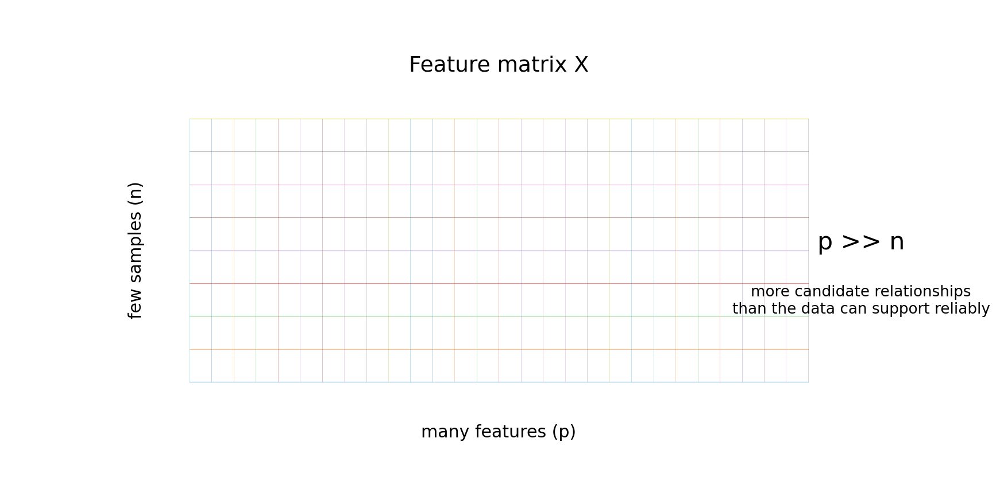
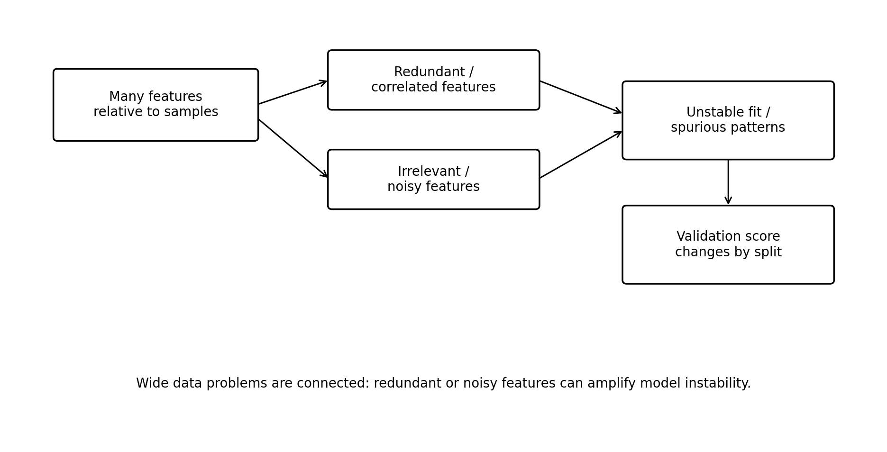

# Generalization in Wide / High-Dimensional Data
Rev. 1 | Created: 2026-09-17 | Updated: 2026-09-17 15:55 KST

## 1. Scope

### 1.1 Problem Statement

Sample 수에 비해 feature 수가 지나치게 많은 high-dimensional / wide data에서는 제한된 sample로 많은 feature의 관계를 학습해야 하므로 모델이 training data에 과도하게 적합될 수 있다. 또한 feature 간 중복, 높은 상관관계, 불필요한 noise 등이 함께 존재할 경우 모델의 안정성과 generalization 성능이 저하될 수 있다.

### 1.2 Goal

Wide data에서 feature dimension이 증가함에 따라 발생할 수 있는 주요 문제를 정리하고, 각 문제를 확인할 수 있는 진단 방법과 generalization 성능 저하를 완화하기 위한 대응 방법을 조사한다.

### 1.3 Non-Goal

Temporal shift나 covariate shift와 같이 Train과 Test 사이의 분포 변화에서 발생하는 generalization 문제는 본 문서의 범위에 포함하지 않는다.

## 2. Problem Taxonomy

Wide data의 문제는 단순히 feature 수가 많다는 사실 하나로 끝나지 않는다. Feature 수가 sample 수에 비해 많아지면 모델이 불안정해지고, 서로 비슷한 feature와 불필요한 feature가 함께 증가하며, validation 결과 역시 split에 민감해질 수 있다.



Fig 1. Wide feature matrix with many features relative to samples

Table 1. Main problems in wide data

| Problem | Main Question | Typical Symptom |
|---|---|---|
| Overfitting / Model Instability | 제한된 sample로 많은 관계를 안정적으로 학습할 수 있는가 | Large Train-Validation gap, unstable coefficient, split sensitivity |
| Redundant / Correlated Features | 서로 비슷한 정보를 가진 feature가 과도하게 존재하는가 | Multicollinearity, duplicated information, unstable importance |
| Irrelevant / Noisy Features | Target과 관계없는 feature가 많이 포함되어 있는가 | Spurious correlation, unstable feature selection |
| Validation Instability | 평가 결과가 특정 split에 지나치게 의존하는가 | Large score variation, inconsistent selected features |



Fig 2. Relationship between major wide-data problems

Fig 2처럼 네 가지 문제는 서로 독립적으로 발생하기보다 연결되는 경우가 많다. Redundant feature와 noisy feature가 많아질수록 모델이 training data에 우연히 존재하는 pattern까지 학습하기 쉬워지고, 그 결과 validation split에 따라 성능이 크게 달라질 수 있다.

## 3. Overfitting and Model Instability

### 3.1 Definition

Wide data에서는 sample 수에 비해 모델이 고려해야 할 feature 수가 많다. 특히 선형 regression에서는 feature마다 coefficient를 추정해야 하므로, sample이 충분하지 않으면 training data에 맞는 여러 관계 중 어떤 관계가 실제로 안정적인지 구분하기 어려워진다.

이 경우 Train 성능은 매우 높지만 validation 성능은 낮을 수 있다. 또한 training sample을 일부 바꾸거나 split을 변경했을 때 coefficient, feature importance 또는 prediction이 크게 달라지는 현상이 나타날 수 있다.

이 문제의 핵심은 단순히 Train score가 높다는 것이 아니라, **학습 sample이 조금 바뀌어도 비슷한 결과가 유지되는가**에 있다.

### 3.2 Diagnosis

Train과 validation 성능의 차이를 확인하고, split이 달라졌을 때 coefficient가 얼마나 달라지는지 함께 보는 것이 좋다. Wide data에서는 score가 비슷하더라도 coefficient 구성이 크게 바뀌는 경우가 있기 때문이다.

다음 예시는 Repeated Cross-Validation에서 Train-Validation gap과 coefficient 변동을 함께 확인한다.

```python
import numpy as np
from sklearn.linear_model import Ridge
from sklearn.model_selection import RepeatedKFold, cross_validate
from sklearn.pipeline import make_pipeline
from sklearn.preprocessing import StandardScaler

model = make_pipeline(StandardScaler(), Ridge(alpha=1.0))
cv = RepeatedKFold(n_splits=5, n_repeats=5, random_state=0)
result = cross_validate(model, X, y, cv=cv, scoring="r2", return_estimator=True, return_train_score=True)

coef = np.vstack([est.named_steps["ridge"].coef_ for est in result["estimator"]])
print("Train mean:", result["train_score"].mean())
print("Valid mean:", result["test_score"].mean())
print("Median coefficient std:", np.median(coef.std(axis=0)))
```

Train-Validation gap이 크거나 coefficient 변동이 큰 경우에는 regularization이나 dimensionality reduction / feature selection의 필요성을 우선 검토할 수 있다.

### 3.3 Mitigation

가장 기본적인 대응은 regularization이다. Ridge는 coefficient의 크기를 제한하여 추정을 안정화하고, Lasso는 일부 coefficient를 0으로 만들어 feature selection 효과를 함께 낼 수 있다. Elastic Net은 L1과 L2 penalty를 함께 사용하며, correlated predictor가 많은 상황과 $p \gg n$ 상황에서 사용할 수 있도록 제안되었다 [[1](#ref-1)].

Regularization만으로 충분하지 않다면 feature 수 자체를 줄이는 방법과 함께 사용해야 한다. 이때 feature reduction은 모든 feature를 무조건 줄이는 것이 아니라, 중복 feature인지 noisy feature인지 먼저 확인한 뒤 선택하는 편이 해석하기 쉽다.

## 4. Redundant and Correlated Features

### 4.1 Definition

Redundant feature는 새로운 정보가 거의 추가되지 않지만 기존 feature와 비슷한 정보를 반복해서 담고 있는 feature이다. 예를 들어 두 feature가 거의 동일하게 움직인다면 feature는 두 개이지만 실제 정보량은 두 배가 아니다.

Correlated feature가 많으면 linear model에서 coefficient가 여러 feature 사이에 불안정하게 나뉠 수 있다. 따라서 prediction 자체는 비슷하더라도 어떤 feature가 중요한지에 대한 해석은 크게 달라질 수 있다.

### 4.2 Diagnosis

가장 단순한 진단은 feature correlation을 확인하는 것이다. 다만 correlation이 높다고 무조건 제거하는 것이 아니라, 같은 정보를 반복하는 feature인지와 domain 의미가 다른 feature인지 함께 판단해야 한다.

```python
import numpy as np
import pandas as pd

corr = X_df.corr(numeric_only=True).abs()
upper = corr.where(np.triu(np.ones(corr.shape), k=1).astype(bool))
high_corr = upper.stack().sort_values(ascending=False)

print(high_corr[high_corr >= 0.95].head(20))
```

위 코드는 correlation이 매우 높은 feature pair를 우선 확인하기 위한 진단 예시이다. Threshold는 고정된 정답이 아니므로 data 특성과 목적에 따라 조정해야 한다.

### 4.3 Mitigation

서로 거의 같은 feature가 반복되는 경우에는 대표 feature를 선택하거나 feature grouping을 사용할 수 있다. Feature를 직접 제거하기 어려우면 dimensionality reduction을 사용할 수 있다.

PCA는 Target을 사용하지 않고 feature variance가 큰 방향을 찾아 차원을 줄인다. 반면 PLS는 $X$와 $y$의 관계를 함께 고려하여 predictive component를 구성하므로 supervised regression에서 사용할 수 있다 [[2](#ref-2)].

Table 2. Dimensionality-reduction choice by data structure

| Data Condition | Method | Main Characteristic |
|---|---|---|
| Dense numeric features | PCA | Unsupervised variance-based compression |
| Regression with many correlated features | PLS | Target-aware latent components |
| Sparse matrix with many zeros | TruncatedSVD | No centering, sparse-matrix friendly |

Sparse matrix에서는 PCA와 TruncatedSVD를 구분할 필요가 있다. PCA는 기본적으로 centering된 data를 사용하지만, TruncatedSVD는 centering을 수행하지 않아 sparse matrix를 효율적으로 처리할 수 있다 [[3](#ref-3)].

```python
from sklearn.decomposition import TruncatedSVD
from sklearn.linear_model import Ridge
from sklearn.pipeline import make_pipeline

model = make_pipeline(
    TruncatedSVD(n_components=50, random_state=0),
    Ridge(alpha=1.0),
)
model.fit(X_train, y_train)
```

여기서 sparse matrix라는 표현은 **실제 matrix 값의 대부분이 0인 구조**를 의미한다. 단순히 high-dimensional space에서 sample이 듬성듬성하다는 의미와는 구분해야 한다.

## 5. Irrelevant and Noisy Features

### 5.1 Definition

Feature 수가 많아질수록 Target과 실제 관계가 없는 feature가 함께 포함될 가능성도 커진다. Sample 수가 적으면 이러한 feature 중 일부가 우연히 Target과 높은 correlation을 보일 수 있으며, 모델이 이를 실제 signal로 학습하면 training data에서는 성능이 좋아 보여도 새로운 data에서는 관계가 유지되지 않을 수 있다.

이 문제는 redundant feature와 다르다. Redundant feature는 유사한 정보를 반복해서 가지고 있지만, irrelevant feature는 Target 예측에 필요한 정보 자체가 거의 없는 경우를 의미한다.

### 5.2 Diagnosis

한 번의 feature importance나 correlation만으로 relevant feature를 확정하기보다, data subset이나 CV split이 달라졌을 때 비슷한 feature가 반복해서 선택되는지 확인하는 것이 좋다.

Stability Selection은 subsampling과 feature selection을 반복하여 feature가 얼마나 안정적으로 선택되는지를 보는 방법이다. High-dimensional variable selection의 불안정성을 줄이는 목적으로 제안되었다 [[4](#ref-4)].

### 5.3 Mitigation

Feature selection은 Target과의 correlation이나 statistical score로 먼저 거르는 filter 방식과, model 학습 과정에서 coefficient나 importance를 이용해 선택하는 embedded 방식부터 검토할 수 있다.

Wide data에서는 가능한 feature 조합이 매우 많기 때문에 모든 subset을 직접 탐색하기보다 이러한 방법으로 후보를 줄이는 편이 현실적이다. Lasso와 Elastic Net은 embedded selection의 대표적인 예이고, Stability Selection은 반복적인 subsampling을 통해 선택 결과의 안정성을 함께 확인할 수 있다.

중요한 점은 feature selection을 전체 data에서 먼저 수행한 뒤 CV를 하면 안 된다는 것이다. Feature selection 과정에서 validation data의 정보가 사용되면 성능이 과대평가될 수 있으므로 selection도 Pipeline 또는 CV 내부에서 수행해야 한다 [[5](#ref-5)].

## 6. Validation Instability

### 6.1 Definition

Wide data는 feature가 많은 동시에 sample 수가 제한적인 경우가 많다. 따라서 validation set에 포함되는 sample 몇 개만 바뀌어도 score가 크게 변할 수 있다.

또한 여러 model, feature subset, hyperparameter를 반복해서 비교하다 보면 validation data 자체에 맞는 설정을 선택할 수 있다. 이 경우 validation score가 높더라도 실제 generalization 성능을 과대평가할 수 있다.

### 6.2 Diagnosis

Validation instability는 single split이 아니라 여러 split의 score 분포를 통해 확인한다. Section 3.2의 model stability 진단과 달리 여기서는 coefficient 자체보다 **평가 결과가 split에 얼마나 민감한가**에 초점을 둔다. Feature selection이 포함되어 있다면 split별로 선택되는 feature의 overlap도 함께 확인할 수 있다.

Table 3. Validation checks for wide data

| Check | Interpretation |
|---|---|
| Mean CV score | Average generalization estimate |
| CV score standard deviation | Split sensitivity |
| Selected-feature frequency | Feature-selection stability |
| Train-CV gap | Possible overfitting |

### 6.3 Mitigation

기본 성능 비교에는 Cross-Validation 또는 Repeated Cross-Validation을 사용할 수 있다. Hyperparameter tuning이나 feature selection까지 포함하여 최종 성능을 추정해야 한다면 Nested Cross-Validation을 고려할 수 있다. 같은 validation data로 tuning과 evaluation을 반복하면 성능이 과대평가될 수 있기 때문이다 [[6](#ref-6)].

Preprocessing, feature selection, dimensionality reduction과 model fitting은 가능한 한 하나의 Pipeline 안에서 수행하는 것이 안전하다. 이렇게 하면 각 CV fold의 training data에서만 transformer가 학습되어 leakage를 줄일 수 있다 [[5](#ref-5)].

## 7. Method Selection

Wide data 대응 방법은 하나의 순서로 고정하기보다 문제 형태에 따라 선택하는 편이 낫다.

Table 4. Practical method selection

| Observed Problem | First Method to Consider | Additional Method |
|---|---|---|
| Large Train-CV gap | Ridge / Elastic Net | Dimensionality reduction / feature selection |
| Many highly correlated features | Ridge / Elastic Net | PCA / PLS |
| Many irrelevant features | Lasso / filter selection | Stability Selection |
| Dense high-dimensional matrix | PCA / PLS | Regularized regression |
| Sparse matrix | TruncatedSVD | Regularized regression |
| Large CV variation | Repeated CV | Nested CV for tuning |

Regularization, feature selection, dimensionality reduction은 경쟁 관계라기보다 함께 사용할 수 있는 방법이다. 예를 들어 correlated feature를 PLS로 줄인 뒤 Ridge를 사용할 수도 있고, filter selection으로 명백한 noise feature를 제거한 뒤 Elastic Net을 적용할 수도 있다.

## 8. Key Points

Wide data의 핵심 문제는 feature 수가 많다는 사실 자체보다 제한된 sample에서 너무 많은 candidate relationship을 학습해야 한다는 데 있다. 따라서 높은 Train score만으로 모델을 평가하기보다 split 변화에 대한 안정성과 feature selection의 반복성을 함께 확인해야 한다.

대응 방법은 data 구조에 맞춰 선택해야 한다. Correlated feature에는 regularization이나 PCA / PLS가 유용할 수 있고, irrelevant feature에는 feature selection이 더 직접적인 대응이 될 수 있다. Sparse matrix에서는 centering 여부 때문에 PCA와 TruncatedSVD의 차이도 고려해야 한다.

## References

<a id="ref-1"></a>
[1] Zou, H. and Hastie, T. (2005), [Regularization and variable selection via the elastic net](https://doi.org/10.1111/j.1467-9868.2005.00503.x), *Journal of the Royal Statistical Society: Series B*, 67, 301-320.

<a id="ref-2"></a>
[2] scikit-learn developers, [Compare cross decomposition methods](https://scikit-learn.org/stable/auto_examples/cross_decomposition/plot_compare_cross_decomposition.html), scikit-learn documentation.

<a id="ref-3"></a>
[3] scikit-learn developers, [TruncatedSVD](https://scikit-learn.org/stable/modules/generated/sklearn.decomposition.TruncatedSVD.html), scikit-learn documentation.

<a id="ref-4"></a>
[4] Meinshausen, N. and Bühlmann, P. (2010), [Stability selection](https://doi.org/10.1111/j.1467-9868.2010.00740.x), *Journal of the Royal Statistical Society: Series B*, 72, 417-473.

<a id="ref-5"></a>
[5] scikit-learn developers, [Common pitfalls and recommended practices](https://scikit-learn.org/stable/common_pitfalls.html), scikit-learn documentation.

<a id="ref-6"></a>
[6] scikit-learn developers, [Nested versus non-nested cross-validation](https://scikit-learn.org/stable/auto_examples/model_selection/plot_nested_cross_validation_iris.html), scikit-learn documentation.

---

## Appendix A. Terminology

- **Cross-Validation (CV)**: Data를 여러 fold로 나누어 training과 validation을 반복하는 평가 방법.
- **Dense matrix**: 대부분의 원소가 0이 아닌 명시적인 값을 가지는 matrix.
- **Dimensionality reduction**: 많은 feature를 더 적은 수의 component 또는 representation으로 변환하는 방법.
- **Elastic Net**: L1과 L2 penalty를 함께 사용하는 regularized linear model.
- **Feature selection**: 전체 feature 중 일부를 선택하여 model input으로 사용하는 과정.
- **Generalization**: Training에 사용하지 않은 data에서도 model 성능이 유지되는 성질.
- **Lasso**: L1 penalty를 사용하여 일부 coefficient를 0으로 만들 수 있는 linear model.
- **Multicollinearity**: 여러 feature가 강하게 관련되어 coefficient 추정이나 해석이 불안정해지는 현상.
- **Nested Cross-Validation**: Model selection을 수행하는 inner CV와 최종 성능을 평가하는 outer CV를 분리한 validation 방법.
- **PCA**: Target을 사용하지 않고 feature variance를 기준으로 low-dimensional component를 구성하는 방법.
- **PLS**: Feature와 Target의 covariance를 고려하여 latent component를 구성하는 supervised method model.
- **Redundant feature**: 다른 feature와 유사한 정보를 반복해서 포함하는 feature.
- **Regularization**: Model parameter의 크기 또는 복잡도에 penalty를 주어 overfitting을 완화하는 방법.
- **Ridge**: L2 penalty를 사용하여 coefficient의 크기를 제한하는 linear model.
- **Sparse matrix**: 원소의 대부분이 0인 matrix.
- **Spurious correlation**: 실제 관계가 없지만 제한된 sample에서 우연히 나타나는 correlation.
- **Stability Selection**: Subsampling과 feature selection을 반복하여 feature 선택의 안정성을 평가하는 방법.
- **TruncatedSVD**: Mean-centering 없이 truncated singular value decomposition을 수행하는 dimensionality-reduction method.
- **Wide data**: Sample 수에 비해 feature 수가 많은 data structure.
